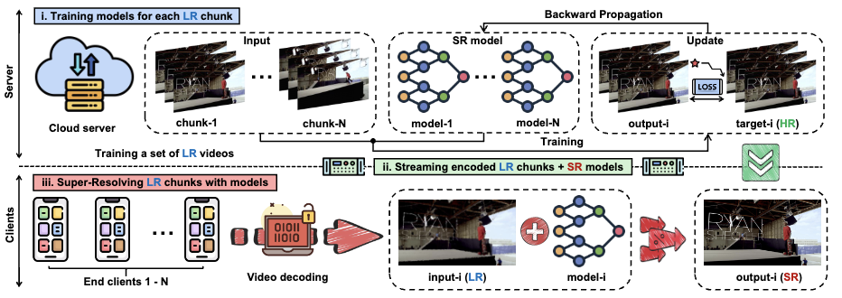
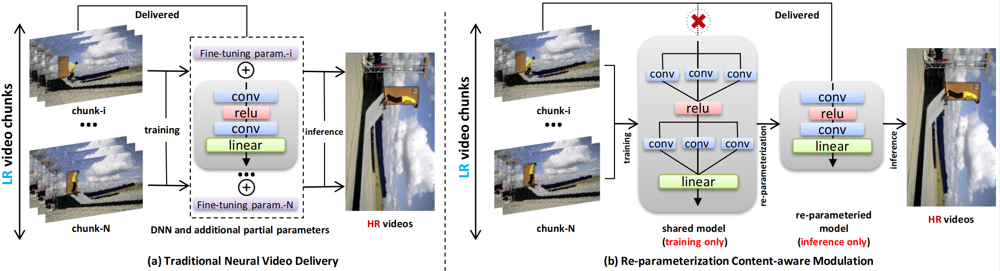

# RepCaM++: Exploring Transparent Visual Prompt with Inference-time Re-parameterization for Neural Video Delivery

[](https://www.computer.org/csdl/journal/tm/5555/01/10949820/25DZuw4IHTy)

 

## News!
The extension version of RepCaM has been accepted by Transaction on Mobile Computing!

# RepCaM: Re-parameterization Content-aware Modulation for Neural Video Delivery

[](https://dl.acm.org/doi/pdf/10.1145/3592473.3592567)

 

## Introduction of dataset VSD4K and VSD4K-2023
Our dataset VSD4K includes 6 popular categories: game, sport, dance, vlog, interview and city. Each category is consisted of various video length, including: 15s, 30s, 45s, etc. For a specific category and its specific video length, there are 3 scaling factors: x2, x3 and x4. In each file, there are HR images and its corresponding LR images. 1-n are training images , n - (n + n/10) are test images. (we select test image 1 out of 10). The VSD4K dataset can be obtained from [https://pan.baidu.com/s/14pcsC7taB4VAa3jvyw1kog] (password:u1qq) and google drive [https://drive.google.com/drive/folders/17fyX-bFc0IUp6LTIfTYU8R5_Ot79WKXC?usp=sharing]. The VSD4K-2023 dataset can be obtained from [https://pan.baidu.com/s/1mNJuKnCfYzd1q6PsyO1b8Q?pwd=d4a0] (password:d4a0)

```
e.g.:game 15s
dataroot_gt: VSD4K/game/game_15s_1/DIV2K_train_HR/00001.png
dataroot_lqx2: VSD4K/game/game_15s_1/DIV2K_train_LR_bicubic/X2/00001_x2.png
dataroot_lqx3: VSD4K/game/game_15s_1/DIV2K_train_LR_bicubic/X3/00001_x3.png
dataroot_lqx4: VSD4K/game/game_15s_1/DIV2K_train_LR_bicubic/X4/00001_x4.png
```

## Dependencies
* Python >= 3.6
* Torch >= 1.0.0
* opencv-python
* numpy
* skimage
* imageio
* matplotlib
## Quickstart
M0 demotes the model without RepCaM module which is trained on the whole dataset. S{1-n} denotes n models that trained on n chunks of video. M{1-n} demotes one model along with n RepCaM modules that trained on the whole dataset. __M{1-n} is our proposed method__.


### How to set data_range
n is the total frames in a video. We select one test image out of 10 training images. Thus, in VSD4K, 1-n is its training dataset, n-(n+/10) is the test dataset. Generally, we set 5s as the length of one chunk. Hence, 15s consists 3 chunks, 30s consists 6 chunks, etc. 
| Video length(train images + test images) | chunks | M0/M{1-n} | S1 | S2 | S3 | S4 | S5 | S6 | S7 | S8 | S9 |
| :---: | :---: | :---: | :----: | :---: | :---: | :---: | :---: | :----: | :---: | :---: | :---: | 
| 15s(450+45) | 3 | 1-450/451-495 | 1-150/451-465 | 151-300/466-480 | 301-450/481-495 | - | - | - | - | - | - | 
| 30s(900+95) | 6 | 1-900/901-990 | 1-150/901-915 | 151-300/916-930 | 301-450/931-945 | 451-600/946-960 | 601-750/961-975 | 751-900/976-990 | - | - | - | 
| 45s(1350+135) | 9 | 1-1350/1351-1485 | 1-150/1351-1365 | 151-300/1366-1380 | 301-450/1381-1395 | 451-600/1396-1410 | 601-750/1411-1425 | 751-900/1426-1440 | 901-1050/1441-1455 | 1051-1200/1456-1470 | 1201-1350/1471-1485 | 


### Train(version without VPS)
For simplicity, we only demonstrate how to train 'game_15s' by our method.

* __For M{1-n} model__: 
```
CUDA_VISIBLE_DEVICES=3 python main.py --model {EDSR/ESPCN/VDSRR/SRCNN/RCAN} --scale {scale factor} --patch_size {patch size} --save {name of the trained model} --reset --data_train DIV2K --data_test DIV2K --data_range {train_range}/{test_range} --dir_data {path of data} --batch_size {batch size} --epoch {epoch} --decay {decay} --segnum {numbers of chunk} --length
```
```
e.g. 
CUDA_VISIBLE_DEVICES=3 python main.py --model EDSR --scale 2 --patch_size 48 --save trainm1_n --reset --data_train DIV2K --data_test DIV2K --data_range 1-450/451-495 --dir_data /home/datasets/VSD4K/game/game_15s_1 --batch_size 64 --epoch 500 --decay 300 --segnum 3 --is15s
```

You can apply our method on your own images. Place your HR images under YOURS/DIV2K_train_HR/, with the name start from 00001.png. 
Place your corresponding LR images under YOURS/DIV2K_train_LR_bicubic/X2, with the name start from 00001_x2.png. 
```
e.g.:
dataroot_gt: YOURS/DIV2K_train_HR/00001.png
dataroot_lqx2: YOURS/DIV2K_train_LR_bicubic/X2/00001_x2.png
dataroot_lqx3: YOURS/DIV2K_train_LR_bicubic/X3/00001_x3.png
dataroot_lqx4: YOURS/DIV2K_train_LR_bicubic/X4/00001_x4.png
```
* The running command is like: 
```
CUDA_VISIBLE_DEVICES=3 python main.py --model {EDSR/ESPCN/VDSRR/SRCNN/RCAN} --scale {scale factor} --patch_size {patch size} --save {name of the trained model} --reset --data_train DIV2K --data_test DIV2K --data_range {train_range}/{test_range} --dir_data {path of data}  --batch_size {batch size} --epoch {epoch} --decay {decay} --segnum {numbers of chunk} --length
```

* For example:
```
e.g. 
CUDA_VISIBLE_DEVICES=3 python main.py --model EDSR --scale 2 --patch_size 48 --save trainm1_n --reset --data_train DIV2K --data_test DIV2K --data_range 1-450/451-495 --dir_data /home/datasets/VSD4K/game/game_15s_1 --batch_size 64 --epoch 500 --decay 300 --segnum 3 --is15s
```

### Reparameterization
```
e.g. 
CUDA_VISIBLE_DEVICES=3 python reparameter_{}.py(eder, espcn)
```

### Test
For simplicity, we only demonstrate how to run 'game' category of 15s. All pretrain models(15s, 30s, 45s) of game category can be found in this link [https://pan.baidu.com/s/1P18FULL7CIK1FAa2xW56AA] (passward:bjv1) and google drive link [https://drive.google.com/drive/folders/1_N64A75iwgbweDBk7dUUDX0SJffnK5-l?usp=sharing]. 

* __For M{1-n} model__: 
```
CUDA_VISIBLE_DEVICES=3 python main.py --data_test DIV2K --scale {scale factor} --model {EDSR/ESPCN/VDSRR/SRCNN/RCAN} --test_only --pre_train {path to pretrained model} --data_range {train_range} --{is15s/is30s/is45s}  --dir_data {path of data} --segnum 3
```
```
e.g.:
CUDA_VISIBLE_DEVICES=3 python main.py --data_test DIV2K --scale 4 --model EDSR_M0 --test_only --pre_train /home/CaFM-pytorch/experiment/edsr_x2_p48_game_15s_1_seg1-3_batch64_k1_g64/model/model_rep.pt --data_range 1-150 --is15s --dir_data /home/datasets/VSD4K/game/game_15s_1 --segnum 3
```
## Citation
Please cite our work if you find it useful.
```bibtex
@inproceedings{zhang2023repcam,
  title={RepCaM: Re-parameterization Content-aware Modulation for Neural Video Delivery},
  author={Zhang, Rongyu and Du, Lixuan and Liu, Jiaming and Song, Congcong and Wang, Fangxin and Li, Xiaoqi and Lu, Ming and Guo, Yandong and Zhang, Shanghang},
  booktitle={Proceedings of the 33rd Workshop on Network and Operating System Support for Digital Audio and Video},
  pages={1--7},
  year={2023}
}
```

## Acknowledgment

AdaFM proposed a closely related method for continual modulation of restoration levels. While they aimed to handle arbitrary restoration levels between a start and an end level, our goal is to compress the models of different chunks for video delivery. The reader is encouraged to review their work for more details. Please also consider to cite AdaFM if you use the code. [https://github.com/hejingwenhejingwen/AdaFM]
